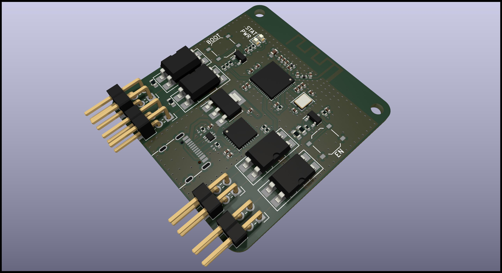

# ESP32 ATX Power Controller

The purpose of this project is to control a computer remotely by connecting
directly to the ATX motherboard power IO control. The control will be done with
Home Assistant by using [ESPHome](https://esphome.io) firmware.

Custom software could be written by using ESP-IDF SDK but it is not the purpose
of this project.


## Hardware

Double 2.54mm pin headers are set for each ATX functionalities to manage:

- `PWR SW`: ATX power button
- `RST SW`: ATX reset button
- `PWR LED`: ATX power state LED
- `HDD LED`: ATX HDD activity LED

Two status LED are available:

- `PWR`: 3.3V state
- `STAT`: System status controlled by software

Two buttons are available for ESP32 boot sequence:

- `BOOT`: Control processor download mode on boot
- `EN`: Control processor reset

For advanced debug, test points are available for JTAG probe.




*Note: 3D shape was not fully configured on my setup, so some components are not
displayed in the render, to be fix.*

### Components choice

This project is based on an ESP32-S2 SoC: `ESP32-S2FH4` (4 MB Flash with no
PSRAM). ESP32 has been selected for the big community to generate software and
the frameworks available. The choice of "S2" is to ensure support with the SDK
for longer time. ESP32 module has not kept due to PCB assembly fees. Espressif
hardware design rules has been take into account following there
[documentation](https://docs.espressif.com/projects/esp-hardware-design-guidelines/en/latest/esp32s2/pcb-layout-design.html)

For easy debug and flashing, an USB-UART bridge has been setup and can manage
boot / reset pins of the ESP32 with hardware flow control.

The optocouplers for electric isolation have been selected following the
[PiKVM](https://github.com/pikvm/pikvm) project experience. In the
[DIY PiKVM V2 instructions](https://docs.pikvm.org/v2/), the OMRON reference is
recommended. Others relays/optocouplers may not be sensitive enough or low-level
controlled.

The 3.3V to power all the components is generated from an LDO using the 5V of the
USB socket.

All others components has been selected from [JLCPCB](https://jlcpcb.com/parts/)
catalogue to minimize the cost and the assembly fees.

### Manufacturing

The board is manufactured by [JLCPCB](https://jlcpcb.com), here is the details
you will require to generate an order.

*Note: JLCPCB requests some modifications on output files, do not use direct
export from KiCad (check the FAQ)*

#### PCB

Files: [Gerbers](jlcpcb/gerbers.zip)

Configuration              | Value
---------------------------|---------------------------------
Base Materiel              | FR-4
Layers                     | 4
Dimensions                 | 44.72 x 42.6
Different design           | 1
Delivery format            | Single PCB
PCB thickness              | 1.6
PCB color                  | Green (other colors have fees)
Silkscreen                 | White
Materiel type              | FR4-Standard TG 135-140
Surface finish             | HASL
Specify layer sequence     | F_Cu / In1_Cu / In2_Cu / B_Cu
Impedance control          | Yes
Layer stackup              | JLC04161H-7628
Via covering               | Tented
Min via hole size/diameter | 0.3mm/0.45mm
Remove order number        | Specify a location

*Note: All options have not been detail here, keep default value.*

#### Assembly

Files: [BOM](jlcpcb/bom.csv), [CPL](jlcpcb/cpl.csv)

Configuration       | Value
--------------------|--------------------
PCBA type           | Economic
Assembly side       | Top
Tooling holes       | Added by JLCPCB

Verify "pick & place" orientations and positions on the web viewer

JLCPCB will add 2 tooling holes for assembly (1 mm diameter near the board corners).

*Note: All options have not been detail here, keep default value.*

### ESP32 Pinout

For those who want to reuse this project, here is the ESP32 pinout to manage the
different input/output.

Name              | Pin  | Direction
------------------|------|----------
System Status LED | IO1  | Output
ATX Power Button  | IO37 | Output
ATX Reset Button  | IO38 | Output
ATX Power State   | IO20 | Input
ATX HDD Activity  | IO21 | Input

## ESPHome configuration

Device must be setup via USB connection the first time to flash the customized
firmware with sensors/buttons configuration.

Once it has been configured successfully, you should fix the device IP on your
router for easier Home Assistant configuration.

Note: Installation can be bypassed if already done or you can use docker image.
Check [ESPHome documentation](https://esphome.io/guides/getting_started_command_line.html)
for more details.

### Installation

```shell
pip install esphome
# Ensure your user session has the correct permission for serial port.
sudo usermod -a -G dialout <USERNAME>
```

### Customize

Depending of your installation and network, a `secrets.yaml` file must be
create with your specific configuration.

```yaml
# secrets.yaml
hostname: MyControllerHostname
wifi_ssid: MySSID
wifi_password: MyStrongPassphrase
wifi_fb_ssid: ATX Controller Fallback Hotspot
wifi_fb_password: StrongPassphrase
ota_password: MyOTAPassphrase
api_key: 32BytesBase64String
```

### Compile and flash

```shell
# Generate the firmware.
esphome compile esphome.yaml
# Flash the firmware to the ESP.
esphome run esphome.yaml
# Get logs.
esphome logs esphome.yaml
```
